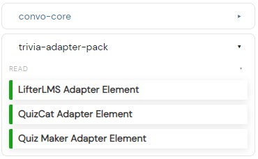

# Convoworks WP Trivia Adapter Package
> This plugin package provides 3 Quiz Adapter elements which extend the existing Convoworks WP Plugin.

## Table of Contents
* [General Info](#general-information)
* [Setup](#setup)
* [Usage](#usage)
* [Plugin links](#plugin-links)

## General Information
- Provides a package of 3 Quiz Adapter elements: QuizCat, Quiz Maker and LifterLMS
- Extends the existing Convoworks WP Plugin
- The purpose of this package is to use other plugin quizzes on the existing Convoworks WP Plugin

## Setup
There are 2 ways to setup this plugin:
1. You can manually download this package here and just paste it into your `wp_content/plugins` folder
2. You can download this package as a zip file and upload the plugin through your Wordpress site

## Usage
1. To use it on the Convoworks WP plugin, we simply just press configure packages when we make a new service and select the name of the plugin package, in this example: `trivia-adapter-pack`

2. When the package is turned on in the configure packages menu then we can see, additionaly to the `convoworks-core` package, there is the `trivia-adapter-pack` package

## Plugin Links
QuizCat link: https://fatcatapps.com    
LifterLMS link: https://lifterlms.com   
QuizMaker link: https://wordpress.org/plugins/quiz-maker/
